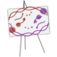

# EscherConverter<sup>1.2</sup> 


**A standalone program that reads files created with the graphical network editor [Escher](http://escher.github.io) and converts them to files in community standard formats.**

[](http://opensource.org/licenses/MIT)
[](https://github.com/draeger-lab/EscherConverter/releases/)
[](http://dx.doi.org/10.1371/journal.pcbi.1004321)
[](https://travis-ci.org/draeger-lab/EscherConverter/)

*Authors:* [Andreas Dräger](https://github.com/draeger), [Devesh Khandelwal](https://github.com/devkhan), [Maria Heitmeier](https://github.com/MariaHei)
________________________________________________________________

## Quick-start

Get a local copy of EscherConverter from [here](https://github.com/SBRG/EscherConverter/releases/latest). As a Java™ application, the only thing needed is a valid Java(JRE) 8+ installation present. After that you can either open the JAr by double-clicking it or use it from the command line as below.

On Unix-like system (Ubuntu, Fedora, macOS, etc.):
```
bash$ java -jar -Xms8G -Xmx8G -Duser.language=en ./EscherConverter.jar --help
```
On Windows:
```
C:\> javaw -jar -Xms8G -Xmx8G -Duser.language=en EscherConverter-0.5 --help
```

## Included third-party software

EscherConverter includes several third-party libraries, which we here list and acknowledge:

* ArgParser
* JSBML
* libSBGN
* Pixel-Mixer icons
* yFiles (obfuscated)
* Randelshofer's macOS filechooser
* Jackson

## Options include:

`--help, -?` 
: displays help information

#### Input and output
`--input=<string>`
    : Specifies the JSON input file. If a directory is given, the conversion will be recursively performed. Accepts JSON.

`--output=<string>`
    : The path to the file into which the output should be written. If the input is a directory, this must also be a directory in order to perform a recursive conversion. Accepts SBML, SBGN.

#### Layout
`--canvas-default-height=<float [1,1E9]>`
: Just as in the case of the width of the canvas, this value needs to be specified for cases where the JSON input file lacks an explicit specification of the canvas height.

`--canvas-default-width=<float [1,1E9]>`
: This value is used when no width has been defined for the canvas. Since the width attribute is mandatory for the layout, a default value must be provided in these cases.

`--label-height=<float [1,1E9]>`
: With this option you can specify the height of the bounding box of text labels.

`--label-width=<float [1,1E9]>`
: This option defines the width of bounding boxes for text labels.

`--node-depth=<float [1,1E9]>`
: The length of nodes along z-coordinate. Escher maps are actually two-dimensional, but in general, a layout can be three-dimensional. This value should be an arbitrary value greater than zero, because some rendering engines might not display the node if its depth is zero.

`--node-label-height=<float [1,1E9]>`
: Node labels can have a size different from general labels in the graph. Here you can specify how height the bounding box of the labels for nodes should be.

`--primary-node-height=<float [1,1E9]>`
: The primary node should be bigger than the secondary node. With this option you can specify the height of this type of nodes.

`--primary-node-width=<float [1,1E9]>`
: Escher maps distinguish between primary and secondary nodes. Primary nodes should be larger than secondary nodes and display the main flow of matter through the network. This option allows you to specify the width of primary nodes.

`--reaction-label-height=<float [1,1E9]>`
: Reaction label height

`--reaction-node-ratio=<float [0,1]>`
: This value is used as a conversion factor to determine the size of the reaction display box depending on the size of primary nodes. Height and width of reaction nodes are determined by dividing the corresponding values from the primary node size by this factor.

`--secondary-node-ratio=<float [0,1]>`
: Similar to the reaction node ratio, the size of secondary nodes (width and height) is determined by dividing the corresponding values from the primary nodes by this value.

`--z=<float [-1E9,1E9]>`
: The position on the z-axis where the entire two-dimensional graph should be drawn.

#### Components and their naming
`--format=<string {SBGN,SBML,Escher}>`
: The desired format for the conversion, e.g., SBML.

`--layout-id=<string>`
: In contrast to the name, this identifier does not have to be human-readable. This is a machine identifier, which must start with a letter or underscore and can only contain ASCII characters.

`--layout-name=<string>`
: This should be a human-readable name for the layout that is to be created. This name might be displayed to describe the figure and should therefore be explanatory.

`--compartment-id=<string>`
: A compartment needs to have a unique identifier, which needs to be a machine-readable Sting that must start with a letter or underscore and can only contain ASCII characters. Since the JSON file does not provide this information, this option allows you to specify the required identifier.

`--compartment-name=<string>`
: With this option it is possible to define a name for the default compartment can be that needs to be generated for the conversion to SBML. The name does not have any restrictions, i.e., any UTF-8 character can be used.

`--infer-compartment-bounds=<boolean>`
: This converter can infer where the boundaries of compartments could be drawn. To this end, it uses each node's BiGG ids to identify the compartment of all metabolites. Assuming that compartments have rectangular shapes, the algorithm can find the outermost node on each side of the box and hence obtain the boundaries of the compartment. However, this methods will fail when metabolites are drawn inside of such a box that belong to a different compartment that is actually further outside. For this reason, this option is deactivated by default.

#### Further options
`--combine=<boolean>`
: If the SBML file contains more than one layout, whether to combine them or not. False by default.

`--extract-cobra=<boolean>`
: If SBMl file is FBC compliant, then extract COBRA model from it. Defaults to false.

#### Options for the graphical interface
`--check-for-updates=<boolean>`
: If true, when application is started it checks for updates on the internet.

`--gui=<boolean>`
: If true, graphical user interface is displayed.

`--log-level=<string {"OFF","SEVERE","WARNING","INFO","CONFIG","FINE","FINER","FINEST","ALL"}>`
: Change the log-level of this application. This option will influence how fine-grained error and other log messages will be that you receive while executing this program.

`--log-file=<string>`
: This option allows you to specify a log file to which all information of the program will be written. Accepts log-File (*.log).

